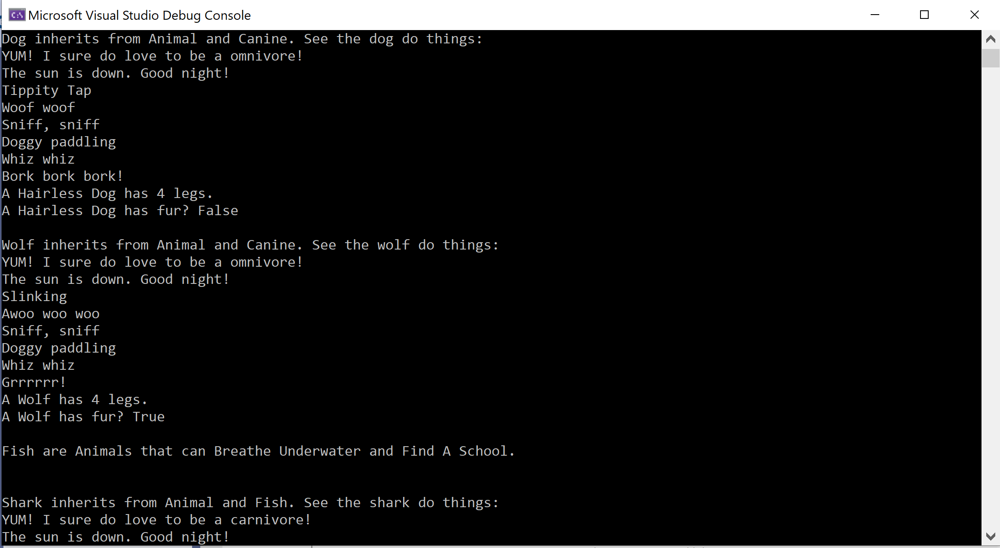
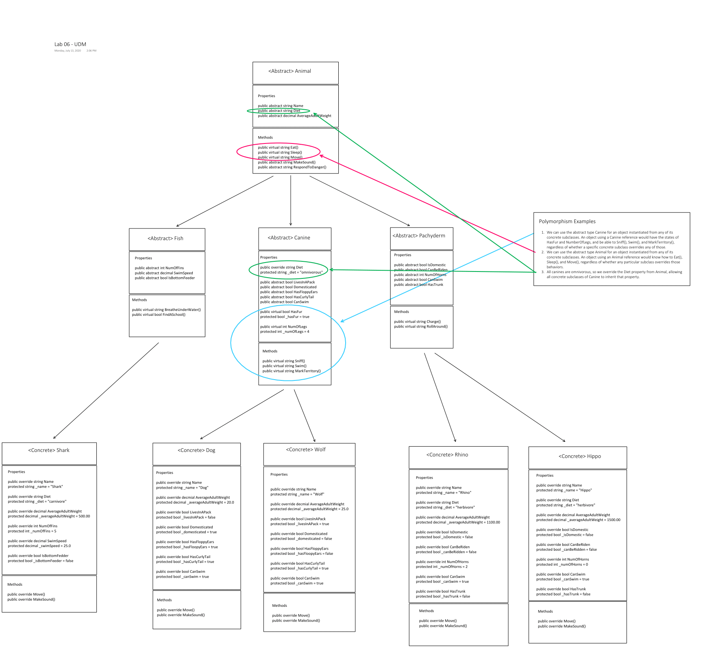

# Lab 07 - OOP Principles

## Authors

- Paul M Rest
- Bade J Habib

---

## Description

Console app that instantiates five concrete animal classes, Shark, Dog, Wolf, Rhino, and Hippo, using three layers of inheritance and four abstract classes.

Demonstrates that each of the five concrete animal classes inherit from their abstract base class(es).

## Technical Overview

Overview of the four OOP principles:

- Inheritance: the functionality of having base and derived classes, wherein derived classes have states and behaviors defined in the base class(es).
- Abstraction: when a derived class has states and/or behaviors defined in the base class, and clients of the derived class can use those without needing to care where they are implemented.
- Polymorphism: an object from a derived class has the type of its base class(es), can be referred to using those base types, and states and/or behaviors invoked in the base classes can be invoked on that object of a derived class.
- Encapsulation: the idea that states and behaviors should be contained within a class, such that clients using objects of that class, or its derived classes, don't need to know how don't need to know how such states and behaviors are implemented, they only need to know how to use them.

Employs the OOP principles of inheritance and abstraction to build off base class properties and methods (states and behavior) towards concrete classes that can be instantiated.

- Inheritance - we have a base abstract class, Animal, that has various properties and methods. The three abstract child classes of Animal, Fish, Canine, and Pachyderm, override some of these properties and methods. Then the five, concrete, classes, Shark, Dog, Wolf, Hippo, and Rhino, implement all of them.

- Abstraction - our five concrete classes use various properties and methods defined in the abstract classes. For example, both Dog and Wolf know how to Sniff(), Swim(), and MarkTerritory() as they gain those methods from their abstract parent class, Canine.

- Polymorphism - our two concrete Canine subclasses, Dog and Wolf, could be used with a reference of type Animal (Canine's superclass) or of type Canine, both of which are abstract classes. Using the Animal reference would give us access to all the public properties and methods defined in Animal, with abstract methods and properties being implemented either in the abstract Canine or concrete Dog/Wolf classes, and public virtual properties and methods either using their behavior/state from Animal, or being overridden in Animal, or Dog/Wolf. Using the Canine reference gives similar access, only with the added properties and methods from the abstract Canine class.

- Encapsulation - a client class using one or more of our concrete Animal subclasses to instantiate objects wouldn't have access to the field that actually stores the value, but rather would only have access to the public property using the field for its returned get value.

---

## Getting Started

Clone this repository to your local machine.

In a command line environment with Git installed:

```
git clone <<GIT REPO URL HERE>>
```

## To Run the Program from Visual Studio (2019):
Select ```File``` -> ```Open``` -> ```Project/Solution```

Next navigate to the directory you cloned the repository to.

Double click on the ```Lab06-OOP-Principles``` directory.

Then select and open ```Lab06-OOP-Principles.sln```

Select ```Debug``` -> ```Start Debugging``` to the run the app with the debugger

OR

Select ```Debug``` -> ```Start Without Debugging```

---

## Visuals

### Console App



### UML



---

## Current Version

v1.5

## Change Log

### 2020-07-14

- Updated README from today's changes
- Added abstract method RespondToDanger(), virtual properties to Canine, implemented encapsulation of overridden properties.
- Updated README from yesterday

### 2020-07-13

- Added unit tests and abstract classes.
- Added concrete classes for Shark and Dog.
- Added concrete classes Hippo and Wolf.
- Added instantiation of concrete classes in Main()
- Updated README.
- Added summary tags.
